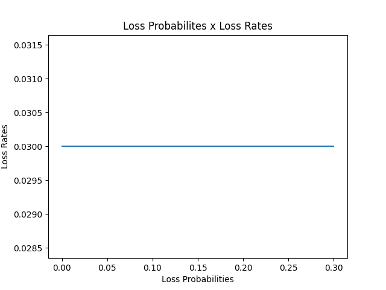
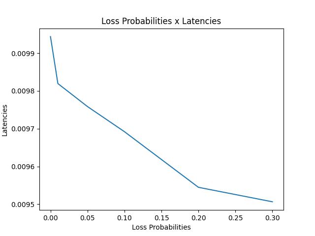

# KNS — Kilop's Network Simulator
> A discrete-event network simulator focused on determinism, modularity, and a solid scientific foundation.

---


## Overview
KNS is an event-driven network simulator inspired by projects like ns-3 and Cisco Packet Tracer. It started as a learning exercise in C++ and networking, but grew into a more complex project with a high-level architecture, clear separation of concerns, and real-time GUI visualization.

The simulator lets you model network topologies, configure parameters such as packet loss probability and packet size, and observe metrics like latency and loss rate during execution.

---


## Features
- **Discrete-event simulation** with deterministic logical time
- **Dijkstra-based routing**, computed once at topology load time
- **Configurable topologies** via JSON files
- **Interactive GUI** with ImGui — visualize nodes, links, and packets in transit in real time
- **Live controls**: adjust loss probability and packet size via sliders
- **Step-by-step mode** to inspect individual events
- **Per-node routing table** accessible by clicking any node on the canvas
- **Statistics export** to CSV for offline analysis
- **Unit tests** with Catch2 and CTest integration

---


## Architecture
```
KNS/
├── app/                    # Main executable and GUI (ImGui + GLFW + OpenGL3)
│   ├── gui/                # Visual components (LatencyChart, MetricsPannel, Window)
│   ├── topologies/         # Sample topologies (mesh4.json, mesh5.json)
│   └── main.cpp
├── core/                   # Simulation engine (reusable library)
│   ├── include/
│   │   ├── engine/
│   │   │   ├── core/       # SimulationEngine, EventQueue, Stats, RunConfig, SimulationClock
│   │   │   └── events/     # Event, PacketGenerationEvent, PacketReceivedEvent, PrintEvent
│   │   └── network/        # Topology, Link, Packet, Routing, TopologyLoader
│   └── src/                # Corresponding implementations
├── docs/                   # Architecture and experiment documentation
├── external/               # Vendored dependencies (glfw, imgui, imguifiledialog)
├── results/                # CSVs and plots generated by the scripts
├── scripts/                # Experiment automation (Python)
├── tests/                  # Unit tests (Catch2)
├── topologies/             # JSON topology files used by the scripts
└── CMakeLists.txt
```


### Key modules
**`core/`** — generic, reusable simulation engine:
- `SimulationEngine` — orchestrates the simulation loop, manages the event queue, routing tables, and statistics.
- `EventQueue` — priority queue that orders events by timestamp; ties are broken by insertion ID, guaranteeing absolute determinism.
- `Routing` — implements Dijkstra's algorithm at O((V + E) log V), executed only once when the topology is loaded.
- `TopologyLoader` — loads topology definitions from JSON.

**`app/`** — presentation layer:
- Renders the network graph on a canvas, animating packets in transit.
- Real-time statistics panels, simulation controls, and per-node details.
- Dynamic topology loading via `ImGuiFileDialog`.

---


## Design Decisions
| Decision | Rationale |
|---|---|
| `std::priority_queue` for events | Ensures correct chronological ordering; ties resolved by ID for full determinism |
| `core/` / `app/` split | `core` is GUI-agnostic and can be reused or unit-tested in isolation |
| Dijkstra only at startup | Recomputing per packet/hop would multiply O((V+E) log V) across every transmission — prohibitively expensive |
| `std::unique_ptr` for events | Eliminates manual memory management and removes the risk of memory leaks |
| Logical time with `int64_t` | Independent of the system clock, wide range for long simulations, guaranteed reproducibility |

---


## Topology Format (JSON)
```json
{
  "nodes": 5,
  "links": [
    { "from": 0, "to": 1, "delay": 5,  "bandwidth": 100, "loss": 0.01 },
    { "from": 1, "to": 2, "delay": 10, "bandwidth": 100, "loss": 0.02 }
  ]
}
```

| Field | Description |
|---|---|
| `nodes` | Number of nodes in the topology |
| `from` / `to` | Source and destination node indices for the link |
| `delay` | Propagation delay (logical ticks) |
| `bandwidth` | Link bandwidth (Mbps) |
| `loss` | Per-link packet loss probability (0.0 – 1.0) |

---


## Prerequisites
- **CMake** ≥ 3.20
- **Visual Studio** (multi-config generator, tested on Windows)
- **Python 3** (for the plotting scripts)

> C++ dependencies (Catch2, GLFW) are downloaded automatically via `FetchContent` on the first CMake configuration. ImGui and ImGuiFileDialog are vendored under `external/`.

---


## Building
```bash
# 1. Generate build files
cmake -S . -B build

# 2. Compile
cmake --build build

# 3. Run tests
ctest -C Debug --output-on-failure
```

---


## Running


### Interactive GUI
```bash
.\build\app\Debug\kns_app.exe <path_to_topology.json>

# Example:
.\build\app\Debug\kns_app.exe .\topologies\mesh5.json
```

Inside the GUI you can:
- **Pause / Resume** the simulation
- **Step** — advance one event at a time
- Adjust **Loss Probability** and **Packet Size** in real time
- Click any node to inspect its **routing table**
- Load a different topology via the **Load Topology** button


### Quick start (full demo)
```powershell
.\scripts\demo.ps1
```

This script builds the project, runs all experiments, and generates the plots automatically.

---


## Experiments & Scripts
The scripts under `scripts/` automate headless batch simulations and plot generation.

```powershell
# Run from the project root:
cd scripts
.\run_all.ps1                   # Sweeps loss probability (0.0 to 0.30)
.\run_packet_size.ps1           # Sweeps packet size (1500 to 6000 bytes)
py plot_results.py              # Plots loss rate and latency vs. loss probability
py plot_results_packet_size.py  # Plots latency vs. packet size
```

CSVs are saved to `results/` and the generated plots can be viewed directly.


### Results



**Key findings:**
- Average latency **decreases** as loss probability increases — dropped packets (which typically travel more hops) are excluded from the latency calculation, pulling the average down.
- Loss rate **grows linearly** with the configured loss probability.
- Latency **grows linearly** with packet size, as expected from the formula `t_transmission = (size × 8) / bandwidth`.

[Read the full analysis](docs/experiments.md)

---


## Tech Stack
| Technology | Role |
|---|---|
| **C++20** | Core language |
| **CMake** ≥ 3.20 | Build system |
| **Catch2** v3.5.2 | Unit testing framework |
| **CTest** | Test runner integrated with CMake |
| **ImGui** | Immediate-mode GUI (docking, sliders, canvas) |
| **GLFW** 3.4 | Window and OpenGL context |
| **ImGuiFileDialog** | In-GUI file picker |
| **Python 3** | Result plotting (`matplotlib`) |

---


## License
Distributed under the terms described in [LICENSE](LICENSE).
